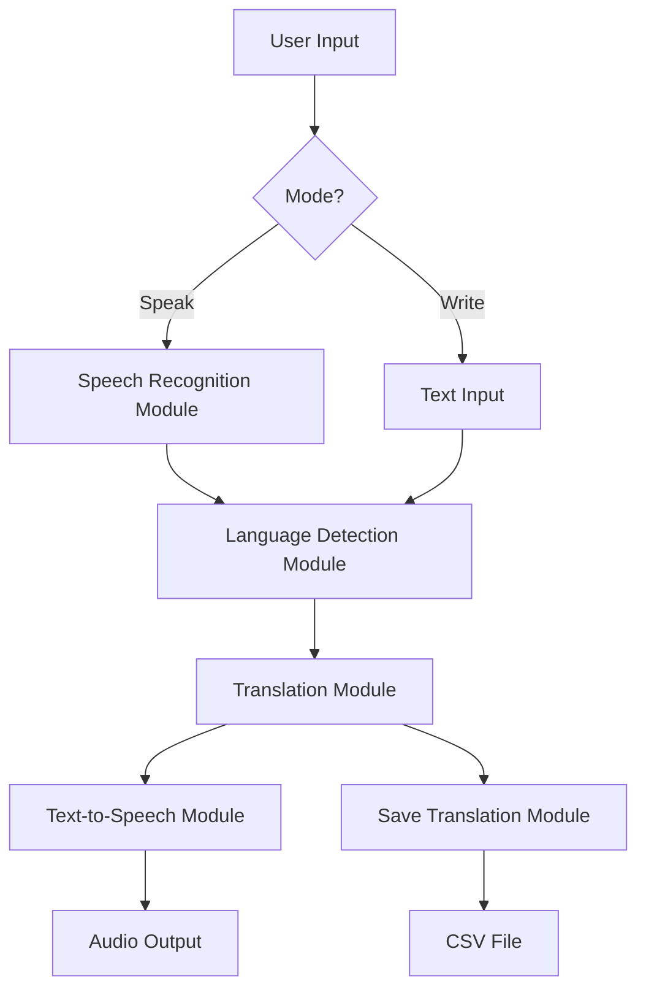

# 🌍 Multi-Language Speech Translation System

<div align="center">


**A modular CLI-based speech translation system supporting real-time multilingual translation with text-to-speech output**

[Features](#-key-features) • [Installation](#-installation) • [Usage](#-usage) • [Architecture](#-architecture) • [Contributing](#-contributing)

</div>

---

## 📋 Table of Contents

- [Overview](#-overview)
- [Key Features](#-key-features)
- [Supported Languages](#-supported-languages)
- [Installation](#-installation)
- [Usage](#-usage)
- [Architecture](#-architecture)
- [Modules](#-modules)
- [Project Structure](#-project-structure)
- [Configuration](#-configuration)
- [Troubleshooting](#-troubleshooting)
- [Future Enhancements](#-future-enhancements)
- [Contributing](#-contributing)
- [License](#-license)
- [Contact](#-contact)

---

## 🌟 Overview

The **Multi-Language Speech Translation System** is a Python-based CLI application that enables real-time speech-to-speech translation across 9+ languages. The system features:

- 🎤 **Speech-to-Text** conversion using Google Speech Recognition API
- 🌐 **Auto Language Detection** and translation with Deep-Translator
- 🔊 **Text-to-Speech** output using Pyttsx3 engine
- 📝 **Translation History** with automatic save functionality
- 🧩 **Modular Architecture** for easy maintenance and extension

**🏆 Achievement:** 2nd Place at 7th Technovation (Paper & Model Contest) - Poornima College of Engineering, 2025

---

## ✨ Key Features

### 🎯 Core Functionality
- ✅ Real-time speech recognition with ambient noise adjustment
- ✅ Bidirectional translation between 9+ languages
- ✅ Automatic source language detection
- ✅ Text-to-speech synthesis in target language
- ✅ Translation history persistence (CSV export)
- ✅ Dual input modes: Voice and Text

### 🛠️ Technical Highlights
- **Modular Design:** 6 independent modules for separation of concerns
- **Error Handling:** Robust exception handling for network failures
- **CLI Interface:** Simple, intuitive command-line experience
- **Offline TTS:** Pyttsx3 works without internet (post-translation)
- **Extensible:** Easy to add new languages or translation engines

---

## 🌐 Supported Languages

| Language | ISO Code | Flag |
|----------|----------|------|
| English | `en` | 🇬🇧 |
| Hindi | `hi` | 🇮🇳 |
| Spanish | `es` | 🇪🇸 |
| French | `fr` | 🇫🇷 |
| German | `de` | 🇩🇪 |
| Japanese | `ja` | 🇯🇵 |
| Chinese (Mandarin) | `zh` | 🇨🇳 |
| Russian | `ru` | 🇷🇺 |
| Arabic | `ar` | 🇸🇦 |

**Note:** Deep-Translator supports 100+ languages. Extend `all_language.txt` to add more.

---

## 📦 Installation

### Prerequisites
- Python 3.8 or higher
- Microphone (for speech input mode)
- Internet connection (for speech recognition and translation)

### Step-by-Step Setup

1. **Clone the repository**
```bash
git clone https://github.com/AryanJain5331/multilingual-speech-translator.git
cd multilingual-speech-translator
```

2. **Install required packages**
```bash
pip install -r requirements.txt
```

**Required Libraries:**
```txt
SpeechRecognition==3.10.0
deep-translator==1.11.4
pyttsx3==2.90
pyaudio==0.2.13  # For microphone access
```

**Note:** On Linux, you may need to install additional dependencies:
```bash
# Ubuntu/Debian
sudo apt-get install portaudio19-dev python3-pyaudio

# macOS
brew install portaudio
```

3. **Verify installation**
```bash
python main.py
```

---

## 🚀 Usage

### Basic Usage

**Run the main program:**
```bash
python main.py
```

**Follow the prompts:**

1. **Select target language:**
```
Enter the language code for translation (e.g., 'fr' for French): es
```

2. **Choose input mode:**
```
Choose mode: 'speak' for speech or 'write' for text input: speak
```

3. **Speak or type your input:**
```
🔵 Speak into the microphone... Say 'exit' to stop.
🎤 Speak something... (Listening)
✅ Recognized Text: Hello, how are you?
🌍 Translated Text (es): Hola, ¿cómo estás?
```

4. **Exit the program:**
```
Say or type: exit
🚪 Exiting program. Have a great day!
```

### Example Sessions

#### Voice Translation (English → Hindi)
```bash
$ python main.py
Enter the language code for translation: hi
Choose mode: speak

🎤 Speak something... (Listening)
✅ Recognized Text: I love machine learning
🌍 Translated Text (hi): मुझे मशीन लर्निंग पसंद है
[Audio plays in Hindi]
```

#### Text Translation (Hindi → English)
```bash
$ python main.py
Enter the language code for translation: en
Choose mode: write

✍️ Enter text to translate: नमस्ते, आप कैसे हैं?
🌍 Translated Text (en): Hello, how are you?
[Audio plays in English]
```

---

## 🏗️ Architecture

### System Flow



### Module Interactions

```
┌─────────────────┐
│   main.py       │
│  (Orchestrator) │
└────────┬────────┘
         │
    ┌────┴────┬────────┬────────┬────────┬────────┐
    │         │        │        │        │        │
    ▼         ▼        ▼        ▼        ▼        ▼
┌──────┐ ┌──────┐ ┌──────┐ ┌──────┐ ┌──────┐ ┌──────┐
│ SR   │ │ LD   │ │ TR   │ │ TTS  │ │ FT   │ │ ST   │
│Module│ │Module│ │Module│ │Module│ │Module│ │Module│
└──────┘ └──────┘ └──────┘ └──────┘ └──────┘ └──────┘

SR  = Speech Recognition
LD  = Language Detection
TR  = Translation
TTS = Text-to-Speech
FT  = File Translation
ST  = Save Translation
```

---

## 📚 Modules

### 1. `speech_recognition_module.py`
**Purpose:** Captures audio from microphone and converts to text

**Key Functions:**
- `recognize_speech()` → Returns recognized text string

**Implementation:**
- Uses `SpeechRecognition` library with Google Speech API
- Adjusts for ambient noise before listening
- Error handling for network issues and unclear audio

**Example:**
```python
from speech_recognition_module import recognize_speech

text = recognize_speech()
# Output: "Hello world"
```

---

### 2. `language_detection_module.py`
**Purpose:** Auto-detects source language of input text

**Key Functions:**
- `detect_language(text)` → Returns ISO language code (e.g., 'en', 'hi')

**Implementation:**
- Uses `deep_translator.GoogleTranslator` auto-detection
- Fallback to English if detection fails

**Example:**
```python
from language_detection_module import detect_language

lang = detect_language("Bonjour le monde")
# Output: 'fr'
```

---

### 3. `translation_module.py`
**Purpose:** Translates text from source to target language

**Key Functions:**
- `translate_text(text, target_language)` → Returns translated string

**Implementation:**
- Uses `deep_translator.GoogleTranslator`
- Auto-detects source language
- Supports 100+ languages

**Example:**
```python
from translation_module import translate_text

translated = translate_text("Hello", "es")
# Output: "Hola"
```

---

### 4. `text_to_speech_module.py`
**Purpose:** Converts translated text to audible speech

**Key Functions:**
- `speak_text(text)` → Plays audio output

**Implementation:**
- Uses `pyttsx3` offline TTS engine
- Configurable voice, rate, and volume
- Works without internet connection

**Example:**
```python
from text_to_speech_module import speak_text

speak_text("Bonjour")
# Audio plays: "Bonjour"
```

---

### 5. `save_translation_module.py`
**Purpose:** Saves translation history to CSV file

**Key Functions:**
- `save_translation(original, translated, target_lang)` → Appends to CSV

**Implementation:**
- Creates `translations.csv` if not exists
- Stores: timestamp, original text, translated text, target language

**Example CSV:**
```csv
Timestamp,Original,Translated,Target Language
2024-11-15 10:30:00,Hello,Hola,es
2024-11-15 10:31:00,Good morning,Bonjour,fr
```

---

### 6. `file_translation_module.py`
**Purpose:** Batch translate text from files

**Key Functions:**
- `translate_file(filepath, target_language)` → Returns translated content

**Implementation:**
- Reads text files line-by-line
- Preserves formatting
- Outputs translated file

---

## 📁 Project Structure

```
multilingual-speech-translator/
├── main.py                             # Main orchestrator
├── speech_recognition_module.py        # Speech-to-text
├── language_detection_module.py        # Auto language detection
├── translation_module.py               # Text translation
├── text_to_speech_module.py            # Text-to-speech
├── save_translation_module.py          # CSV export
├── file_translation_module.py          # File translation
├── all_language.txt                    # Supported language list
├── requirements.txt                    # Python dependencies
├── README.md                           # Documentation
└── translations.csv                    # Translation history (auto-generated)
```

---

## ⚙️ Configuration

### Customizing TTS Voice

Edit `text_to_speech_module.py`:

```python
def speak_text(text):
    engine = pyttsx3.init()
    
    # Customize voice
    voices = engine.getProperty('voices')
    engine.setProperty('voice', voices[1].id)  # Change to 0 or 1
    
    # Adjust speech rate (default: 200)
    engine.setProperty('rate', 150)  # Slower
    
    # Adjust volume (0.0 to 1.0)
    engine.setProperty('volume', 0.9)
    
    engine.say(text)
    engine.runAndWait()
```

### Adding New Languages

1. Check supported languages: [Google Translate Languages](https://cloud.google.com/translate/docs/languages)
2. Update `all_language.txt` with new language codes
3. No code changes required!

---

## 🐛 Troubleshooting

### Common Issues

#### 1. **"Could not understand the audio"**
**Cause:** Background noise or unclear speech
**Solution:**
- Speak closer to the microphone
- Reduce background noise
- Try text input mode instead

#### 2. **"ModuleNotFoundError: No module named 'pyaudio'"**
**Cause:** PyAudio not installed properly
**Solution:**
```bash
# Windows
pip install pyaudio

# macOS
brew install portaudio
pip install pyaudio

# Linux (Ubuntu/Debian)
sudo apt-get install portaudio19-dev
pip install pyaudio
```

#### 3. **"Could not request results"**
**Cause:** No internet connection
**Solution:**
- Check network connectivity
- Speech recognition requires internet
- Translation requires internet
- TTS works offline

#### 4. **Translation not working for certain languages**
**Cause:** Invalid ISO code or unsupported language
**Solution:**
- Verify language code in `all_language.txt`
- Check [supported languages](https://py-googletrans.readthedocs.io/en/latest/#googletrans-languages)

---

## 🔮 Future Enhancements

### Planned Features
- [ ] **GUI Version:** Tkinter or PyQt interface
- [ ] **Whisper Integration:** Use OpenAI Whisper for offline speech recognition
- [ ] **Streamlit Web App:** Browser-based interface
- [ ] **Real-time Streaming:** Continuous speech translation
- [ ] **Voice Selection:** Choose male/female voice for TTS
- [ ] **Translation Accuracy Metrics:** Display confidence scores
- [ ] **Audio File Input:** Translate from MP3/WAV files
- [ ] **API Endpoint:** REST API for programmatic access

### Advanced Features
- [ ] **Neural Machine Translation:** Use transformer models
- [ ] **Context-Aware Translation:** Maintain conversation history
- [ ] **Dialect Support:** Regional language variations
- [ ] **Sentiment Preservation:** Maintain tone in translation

---

## 🤝 Contributing

Contributions are welcome! Here's how you can help:

### How to Contribute

1. Fork the repository
2. Create a feature branch (`git checkout -b feature/NewTranslationEngine`)
3. Commit your changes (`git commit -m 'Add Whisper speech recognition'`)
4. Push to the branch (`git push origin feature/NewTranslationEngine`)
5. Open a Pull Request

### Contribution Ideas
- Add new translation engines (DeepL, Microsoft Translator)
- Implement Whisper for offline speech recognition
- Create a GUI version (Tkinter, PyQt, Streamlit)
- Add unit tests
- Improve error handling
- Write documentation for new features

---

## 📄 License

This project is licensed under the MIT License - see the [LICENSE](LICENSE) file for details.

---

## 📧 Contact

**Aryan Jain**

- Email: aryanjainkumar@gmail.com
- LinkedIn: [linkedin.com/in/aryan-jain232](https://www.linkedin.com/in/aryan-jain232/)
- GitHub: [@AryanJain5331](https://github.com/AryanJain5331)

**Project Link:** [https://github.com/AryanJain5331/multilingual-speech-translator](https://github.com/AryanJain5331/Multi-Language-Speech-Translation-System)

---

## 🙏 Acknowledgments

- **SpeechRecognition Library:** Google Speech Recognition API
- **Deep-Translator:** GoogleTranslator backend
- **Pyttsx3:** Offline text-to-speech engine
- **Inspiration:** Breaking language barriers with AI
- **Award:** 2nd Place, 7th Technovation Competition, Poornima College of Engineering

---

<div align="center">

**⭐ Star this repository if you found it helpful!**

Made with ❤️ by [Aryan Jain](https://github.com/AryanJain5331)

</div>
